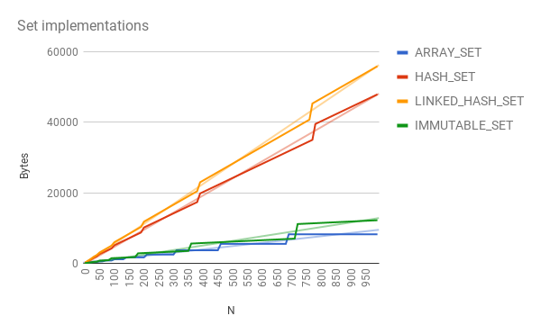

# Guava and Android

## 背景
曾几何时，在Android应用程序中使用Guava通常是不受欢迎的
在谷歌上开发，因为Guava是针对服务器Java开发中的条件进行设计、测试、基准测试和优化的。
这种情况不是最优的:Android开发人员发现他们在重新发明轮子，笨拙地处理API之间的差距，
并且他们的最佳实践与其他Java开发的最佳实践相背离。

在2017年，我们与谷歌的Android专家合作，广泛地改变了这种情况:优化番石榴的一个分支，使其适合Android。我们就下列优先事项达成一致意见:

*   不要在API设计原则上妥协。维护Android和主线分支之间的API兼容性。
*   优化代码大小_after应用ProGuard收缩。大多数Android应用程序需要优先考虑APK大小，但是对于需要考虑这一点的应用程序，
    他们应该已经使用了ProGuard。为了简单起见，在应用了谷歌内部版本的ProGuard之后，我们以字节、类和方法的形式测量了收缩的JAR大小，
    但是大多数代码收缩工具应该会显示类似的结果。
*   优化对象和字节的最小分配。垃圾收集在Android上通常更昂贵。
*   虽然在CPU性能上牺牲一些常量因素是可以容忍的，但是要避免渐进的慢化。

由于这项工作，谷歌的内部Android最佳实践已经从禁止使用番石榴变成积极推荐番石榴的关键部分。

## 特点

即使完成了这项工作，也不是所有的Guava都推荐在Android上使用。我们将优化工作集中在一些关键的数据结构和api上。
不严格地说，我们建议不要做以下事情:

*   `cache` (更喜欢 `LruCache` 替代)
*   `eventbus` (使用 reflection)
*   `reflect` (使用 reflection)
*   `graph` (使用昂贵的数据结构，通常不值得)
*   `collect.Table` (使用昂贵的数据结构，通常不值得)

## 细节

这项工作包含了许多琐碎的优化工作，但我们可以从中挑出一些亮点。首先，我们在减少许多类型的代码大小占用方面取得了重大进展，其中大部分工作集中在“common.collect”上。

下面的图表显示了几个关键api的JAR大小的前后，以及在适当的ProGuard剥离之后进行的所有测量。

We found many tricks for reducing code size, but the most important were

*   removing unnecessary use of skeleton classes
*   making it easier for ProGuard to eliminate dead code
*   reducing static constants that could not be inlined, or moving them to
    helper classes

This work often went hand in hand with rewriting of underlying data structures,
especially in `common.collect`. Our primary goals for our data structures were:

*   O(1) total objects in the “steady state” data structure (retained if you
    keep a reference to the collection itself)
*   Asymptotics equivalent to the appropriate equivalent mutable data structures
    (`LinkedHashMap`, etc.)
*   Constant factors for memory consumption competitive with best-of-breed
    Android data structures (`ArrayMap`, `ArraySet`, even though those data
    structures gave up O(1) asymptotics)
*   Share objects where possible with the builder, to reduce garbage allocation

This required rewriting many of our core data structures in the Android fork,
especially requiring us to avoid entry objects wherever possible. For example,
`ImmutableMap` on Android is now backed by a flattened hash table built of
parallel arrays, with the hash table storing indexes into another array rather
than storing pointers to entry objects. Similarly, we developed algorithmic
tweaks allowing `ImmutableSortedMap` to sort the keys and values together
without combining them into `Entry` objects as would typically be required.

Generally speaking, we did not achieve data structures that were _as_ compact as
Android's `ArrayMap` and `ArraySet`, but we came close while still providing the
O(1) asymptotics we expect from these structures.

Other data structures, unique to Guava, showed similar improvements even if they
did not have competition. For example:

Data structure       | Bytes/entry (before) | Bytes/entry (after)
-------------------- | -------------------- | -------------------
`HashBiMap`          | 64                   | 40
`HashMultiset`       | 59                   | 24
`LinkedHashMultiset` | 67                   | 32

We did, in some cases, accept asymptotic slowdowns to view collections where
workarounds were easily available. For example, few users know -- or care --
that `ImmutableSet.asList()` returned a "magical" `ImmutableList` with an O(1)
`contains` implementation. Eliminating the specialized implementation in the
Android branch allowed us to make significant code size savings, and the
workaround of just calling `contains` on the `ImmutableSet` directly is easy
enough.
